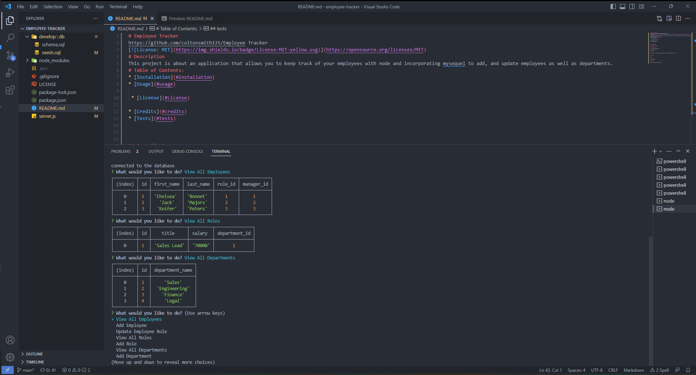

# Employee Tracker
https://github.com/coltonsmith135/Employee Tracker

# Description
This project is about an application that allows you to keep track of your employees with node and incorporating mysequel to add, and update employees as well as departments.
# Table of Contents:
* [Installation](#installation)
* [Usage](#usage)

 * [License](#License)

* [Credits](#credits)
* [Tests](#tests)

## installation

node, mysql, inquirer

## contact info

coltonsmith135@yahoo.com

503-432-0228

## usage

It is used to keep track of employees as well as departments and roles

## License

  MIT

## credits

Colton Smith

## tests

running through node and mysql

https://drive.google.com/file/d/1fIie-Ws7Vwy6Z9U_bApyto-amT5wPqIX/view

